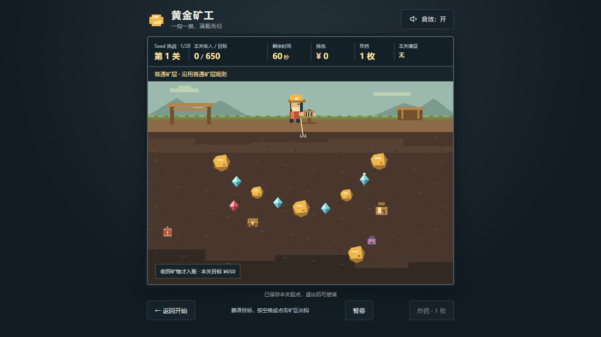

# 黄金矿工 · 无限生存

原生 HTML、CSS、JavaScript 和 Canvas 2D 像素风单机游戏，无构建步骤或第三方运行依赖。当前源码 **v1.5.0：抓取与成就体验调整、项目整合**；新挑战规则 **1.5.0**，旧活动保留 **1.4.0** 的地图、尺寸和报价。三项需求、两阶段备份与验收、项目整理和完整 GitHub 交付已完成。正式玩家包已匿名下载复验，源代码、文档、脚本与证据均同步 main。



## 游玩

双击 `index.html`，使用 Chrome、Edge 等现代桌面浏览器打开。选择模式后点击“开始无限挑战”“开始 Seed 挑战”或“开始今日挑战”；已有存档时点击对应模式的继续按钮，下方会说明旧挑战的模式、关号及 Seed／每日日期。玩家包解压整个目录后直接打开，无需 Node.js 或联网。

[下载 v1.5.0 玩家包](https://github.com/OldBeer1/gold-miner/releases/download/v1.5.0/Gold-survival-v1.5.0.zip) · [版本说明](https://github.com/OldBeer1/gold-miner/releases/tag/v1.5.0) · [源码仓库](https://github.com/OldBeer1/gold-miner)。本地同一玩家包为 `output/release/Gold-survival-v1.5.0.zip`，打包、独立解压及公开下载复验见 [VALIDATION.md](VALIDATION.md)。

需要本地服务时，在项目根目录使用 **PowerShell**：

```powershell
node .\scripts\serve.cjs
```

打开 [本机游戏](http://127.0.0.1:8080)，Ctrl+C 停止；端口占用可用 `node .\scripts\serve.cjs 8081`。文件直开无需服务，两种地址使用各自的浏览器存档。

## 操作与流程

| 操作 | 行为 |
| --- | --- |
| 空格／点击矿区 | 待机时出钩 |
| ↓／S／炸药按钮 | 销毁携带物，快速空钩返回 |
| Esc／暂停按钮 | 暂停或继续；切标签自动暂停，回来需主动继续 |
| 返回开始 | 保留挑战入口或商店存档，回主页 |
| 音效开关 | 切换音效并保存 |

每关基础 60 秒，提前达标仍可继续赚钱，到截止结算。物体完整收回才入账；火药桶碰撞即原地爆炸，范围销毁无奖励。成功后入店再进入下一关，Seed／每日第 20 关成功则完成赛程；失败结束挑战。

钱包、炸药跨关保留，增益只影响下一关。成绩仅累计成功关收入，购物不扣成绩，失败关不累计。前三关热身，10～19 同档，20、30、40……关升档；每关保留 45 秒内无炸药／增益达标路线。精确物体、概率、价格、难度和截止规则统一在 [GAME_SPEC.md](GAME_SPEC.md)。

## 保存

- 入关前保存起点；关内退出／刷新后回同一入口，保留布局和随机结果，关内收入、道具消耗与时间奖励回滚。
- 成功结算和成功购物保存商店；恢复商品、报价、资金、库存、限购和增益，成绩不重复入账。
- 返回主页保留挑战，新挑战确认覆盖，取消不改存档；正常存储时失败清挑战，最高纪录保留。
- 保存被拒绝或数据损坏时显示真实结果，当前页面仍可玩，但关闭后不能保证最新状态。存档只属于当前浏览器与地址。

成长档案、活动挑战和近期报告统一保存。合法 v1.4.0 档案先备份原文后一次升级，主键保持、旧活动与历史成果保留；结算写入失败明确提示“已记录，本次未能保存”，沿用内存保留和现有重试机制。有效 v1.1.0／v1.2.0 档案显式迁入，当前布局、交易、最高纪录与永久成果保留；v1.2.0／v1.4.0 原文首次升级备份，旧键保留。损坏或未知的新档案保留原数据，可临时游玩；其他页面更新档案时冻结并要求重新载入，按单页面游玩设计。键、结构及异常边界见 [现行规格的保存章节](GAME_SPEC.md#7-自动保存与历史记录)。

## 矿工成长档案

主页新增“矿工档案”“成就”“矿井图鉴”和最近报告。13 项现行成就提供徽章及部分可装备称号，称号只作展示；支持分类与解锁筛选，已获得的下架任务另作历史卡片保留。

生涯统计区分成功关有效成绩、包含最终失败关的实际回收收入、出钩／命中／回收与有效采矿时长。9 类图鉴先记录布局发现，再由实际回收或火药桶引爆完成研究；钱袋 5 档和宝箱 3 档奖励需回收后发现。

本关统计与成就候选在结算后保存，入口重试会回滚。失败保存单局报告，确认覆盖生成主动放弃报告，只包含已提交成果；最近报告最多 10 份。暂停可打开资料，关闭后仍需主动继续。

## 随机矿层与挑战

第 5 关起，每 5 关有 60% 机会遇到黄金热潮、钻石矿脉、地质不稳定、黑市或贫瘠矿层。商店提前显示实际矿层、目标与固定报价，购买和刷新不重抽；各事件仍保留 45 秒内无道具达标路线。

主页可选无限生存、Seed 挑战、每日挑战。Seed 接受 0～4294967295 的整数，每日使用设备 UTC+8 日期；Seed 与每日均为 20 关赛程，第 20 关成功后生成赛程完成报告。跨日继续保留原日期与地图，新每日局使用当前日期。离线日期与成绩不防作弊，允许重复练习。

三种模式分别汇总生涯；无限最高纪录与13 项现行成就仍只在无限模式取得。每日／Seed 个人最佳按赛题与规则分开，依次比较通过关数、有效成绩、有效采矿时长，保留最近更新的 200 个赛题。个人最佳在矿工档案内按最近更新时间展示，支持全部／每日／Seed 筛选，每页 10 条，筛选与页码只保留在页面内。报告可复制包含模式、日期、Seed、规则与成绩的分享文本，剪贴板受限时支持手动复制。当前只有一份活动挑战，切换模式确认覆盖，取消不改数据。

## 抓取与页面体验

小金块、钻石、红宝石和钱袋扩大可见尺寸与正式碰撞范围；间距和边界同步校准，采用现有轮廓局部容错，石头和火药桶仍按最早碰撞阻挡。基础价值、计时、回速、概率与价格保持。首次回收、累计金块／钻石／回收数、较低收入和 10 关目标带来正常游玩反馈，完整条件见现行规格。

矿层说明置于 HUD 下方、画布上方，完整文字自然换行，不覆盖采矿区域。首次打开根据活动存档初始化模式和 Seed；当前页面主动选择的模式保留，继续旧挑战不会改选。回主页优先聚焦继续按钮，没有活动存档时聚焦新挑战按钮。

采矿帧只更新必要的动态信息，主页和固定信息在变化时更新，保持原物理步长与绘制循环。主页独立检查 UTC+8 日期，离开或隐藏标签时停止日期定时器，不推进游戏时间。布局已覆盖三种桌面视口，短屏支持滚动；实际证据与测量边界见验收记录。

## 开发与验证

在项目根目录使用 **PowerShell** 执行无第三方运行依赖的检查：

```powershell
node .\scripts\check-checkpoints.cjs
node .\scripts\check-growth.cjs
node .\scripts\check-challenges.cjs
node .\scripts\check-rules.cjs
node .\scripts\check-ui-compat.cjs
node .\scripts\check-gameplay.cjs
node .\scripts\check-project.cjs
```

浏览器检查需要开发环境已有 Playwright 和 Chrome；必要时用 `GOLD_PLAYWRIGHT_MODULE` 指向已有包。脚本在 `output/playwright/`，它们不属于游戏运行依赖。

| 脚本 | 检查内容 |
| --- | --- |
| `verify-survival-v150-challenges.cjs` | 事件、三模式、20 关结束与保存重试、日期、迁移、分享、文件／HTTP 和三视口 |
| `verify-survival-v150-experience.cjs` | 新旧 DOM 更新对比、日期定时器、模式／焦点、0／10／11／200 记录分页、保存拒绝与外部修订 |
| `verify-survival-v150-real-run.cjs` | 原始随机无限地图真实四关四店、第五关自然失败，自然取得 8 项成就 |
| `verify-survival-v150-native-pause.cjs` | 原生标签隐藏与恢复、主页日期定时器取消和重建 |
| `verify-survival-v150-smoke.cjs` | 最终画面、缩放输入、文件／HTTP、七类音效与静音 |
| `verify-survival-v150-achievements.cjs` | 现行／历史徽章与称号、旧规则商店和新规则重开 |
| `measure-survival-v150.cjs` | 三视口目标尺寸测量 |
| `verify-survival-release.cjs` | 独立解压玩家包的运行完整性，按实际能力检测挑战并读取现行成就数量 |

浏览器脚本自行启动并关闭各自的本地测试服务。旧版脚本与报告保留用于历史追溯，当前验收使用上述 v1.5.0 入口；兼容检查读取已发布 v1.4.0 源码标签，核对旧规则继续结果。实际结果、测试条件和局限只在 [VALIDATION.md](VALIDATION.md) 维护；纯文档修改检查内容与链接，不重复完整游戏试玩。

玩家包沿用 [package-release.ps1](scripts/package-release.ps1)，[check-player-package.ps1](scripts/check-player-package.ps1)独立解压核验，[verify-public-release.ps1](scripts/verify-public-release.ps1)核验匿名下载，使用对应实现版本号，核对运行文件、清单、SHA-256 和独立解压结果。保留旧 ZIP，排除依赖、缓存、浏览器配置和日志；每个版本验收后按 [AGENTS.md](AGENTS.md) 的完整 GitHub 交付要求执行。

## 开发入口与后续路线

| 文档 | 职责 |
| --- | --- |
| [AGENTS.md](AGENTS.md) | 接手顺序、开发与验证约定 |
| [GAME_SPEC.md](GAME_SPEC.md) | 当前已经实现的玩法、数值与保存规则 |
| [FEATURE_ROADMAP.md](FEATURE_ROADMAP.md) | 产品路线、设计原则和后续待定范围 |
| [GAMEPLAY_IMPROVEMENT_PLAN.md](GAMEPLAY_IMPROVEMENT_PLAN.md) | 此次三项需求、定稿方案、30～35 步门槛和原始提示词追溯 |
| [IMPLEMENTATION_PLAN.md](IMPLEMENTATION_PLAN.md) | 当前状态、唯一分步索引和最新交接 |
| [VALIDATION.md](VALIDATION.md) | 当前版本实际验证与限制 |
| [docs/HISTORY.md](docs/HISTORY.md) | 旧规格、完成步骤、历史交接与验收原文索引 |

第 01～29 步、旧规格／规划／交接／验收原文从历史索引查阅，17～28 独立任务合并归档。本轮 30～35 步按先游戏验收、再备份整理执行；实际删改范围见 [清理清单](docs/CLEANUP_V150.md)，全部任务状态只在实施计划维护。

| 文件 | 实现职责 |
| --- | --- |
| `index.html` / `styles.css` | 中文页面、商店和布局 |
| `js/config.js` | 数值、概率与配置 |
| `js/rules.js` | 确定性生成、路线、碰撞、奖励、交易与快照 |
| `js/game.js` | 页面流程、输入、单更新循环与绘制 |
| `js/storage.js` | 保存校验、恢复与旧音效继承 |
| `js/growth.js` | 稳定成就目录、暂存统计、图鉴、统一档案更新与报告 |
| `js/challenges.js` | 模式、20 关赛程、Seed 规范化、UTC+8 日期、派生、纪录比较与分享 |
| `js/effects.js` / `js/audio.js` | 视觉与音效反馈 |
