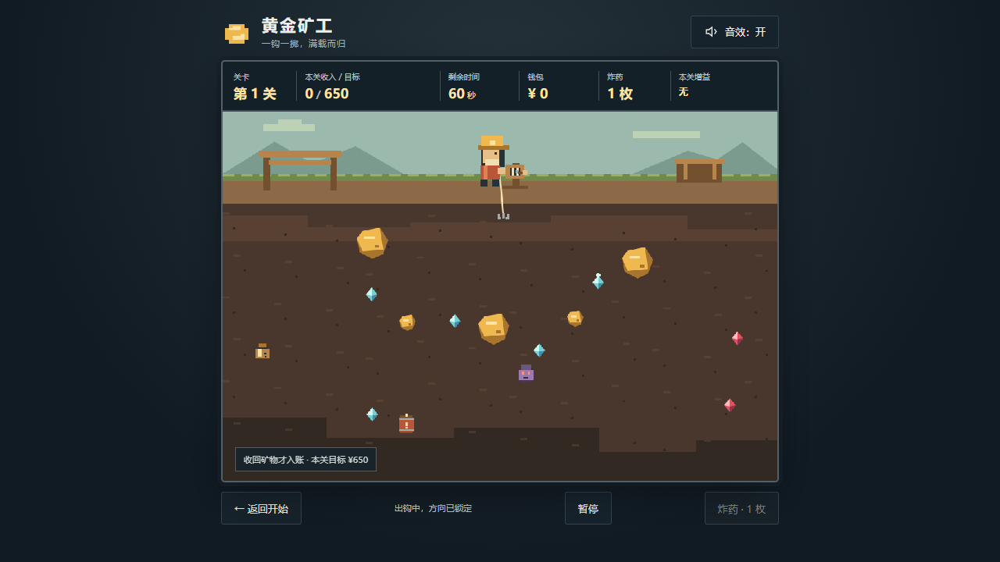

# 黄金矿工 · 无限生存

复古像素风的电脑浏览器单机游戏，采用原生 HTML、CSS、JavaScript 和 Canvas 2D。**第 08～12 步全部实现并通过验收**，无需构建、安装运行依赖或联网加载素材。原三关版记录保留为历史交接。

## 下载游玩

**[下载 Gold-survival-v1.0.0.zip](https://github.com/OldBeer1/gold-miner/releases/download/v1.0.0/Gold-survival-v1.0.0.zip)** · [版本说明](https://github.com/OldBeer1/gold-miner/releases/tag/v1.0.0) · [公开源码与文档](https://github.com/OldBeer1/gold-miner)

下载后先解压整个 ZIP，再用 Chrome、Edge 等现代桌面浏览器打开其中的 **index.html**。玩家包仅含游戏运行文件和中文使用说明，不需要 Node.js、安装依赖或构建。



## 运行

Windows 中双击 index.html，用 Chrome、Edge 等现代桌面浏览器打开；也可在项目目录的 **PowerShell** 中运行：

```powershell
Start-Process .\index.html
```

可选 Node.js 本地服务：

```powershell
node .\scripts\serve.cjs
```

访问 [本地游戏](http://127.0.0.1:8080)，Ctrl+C 结束服务。端口占用时用 `node .\scripts\serve.cjs 8081`。文件直开不需要 Node.js。

正式玩家下载包位于 [GitHub Release](https://github.com/OldBeer1/gold-miner/releases/tag/v1.0.0)。开发源码、需求、分步文档、AGENTS.md 和验收证据位于本仓库；本地旧 Gold-game.zip / Gold-survival.zip 保留为历史交付文件，不纳入 Git。

## 玩法与操作

| 操作 | 行为 |
| --- | --- |
| 空格 / 点击矿区 | 钩子待机时沿当前角度出钩 |
| ↓ / S / 炸药按钮 | 销毁携带物，不触发收益或风险，快速空钩收回 |
| Esc / 暂停按钮 | 暂停或继续；切标签页自动暂停，回来需主动继续 |
| 音效开关 | 开启或关闭全部音效并保存设置 |
| 返回开始 | 结束当前挑战 |

每次挑战从第一关随机生成，没有最终关卡。每关基础时间 60 秒，提前达标可继续赚钱，到时间才结算；收回锚点才入账。在途超时物体不计收入或特殊效果。

前十关目标从 650 每关增加 150，物体从 15 每关增加 1；第十关后固定目标 2000、物体数 24。每关经过真实规则模拟检查，存在不使用药水或炸药的 45 秒内达标路线。

成功 → 商店 → 下一关。失败结束本轮，“重新挑战”从第一关清空资源并生成新地图。钱包和炸药跨关保留；总收入只累计成功关卡，购物不扣成绩，失败关收入不累计。

## 抓取物与风险

保留小金块、大金块、石头、钻石，新增五种：

| 物体 | 收回结果 |
| --- | --- |
| 红宝石 | 收入 350 |
| 神秘钱袋 | 随机金币、炸药、时间；有小概率扣 5 秒 |
| 宝箱 | 随机收入 150、450 或 800 |
| 诅咒古物 | 收入 500，时间 -5 秒 |
| 火药桶 | 钩尖碰到立即原地爆炸，清除周围物体，不扣时间 |

火药桶无需拖回，钩尖碰到就立即爆炸；逻辑画布 80 像素范围内的未回收物体消失，抓钩空钩返回。桶和被炸毁物体没有收益或特殊效果，不扣时间、不消耗炸药或护身符，其他桶被销毁也不连锁扩大爆炸。

其他物体的特殊效果在收回时触发，提前用炸药销毁可规避。古物先入账再扣时间；时间扣到 0 立即结算。护身符只抵消古物或钱袋的第一次时间惩罚。时间奖励包括延时券，每关累计最多 +20 秒，因此最多 80 秒。钱袋炸药奖励库存满时转为金币 +100。

## 商店

每次固定炸药，加随机三种增益，共四种商品；**累计最多购买四件**。买一枚炸药也计一件；非炸药限购一份。缺钱、库存满、重复购买和购买次数满时不扣钱。商品不刷新、不补货，购买可选。

| 商品 | 价格 | 效果 |
| --- | ---: | --- |
| 炸药 | 100 | +1 枚，持有上限五枚 |
| 力量药水 | 200 | 带物回收速度 ×1.5 |
| 钻石增值剂 | 200 | 钻石价值 ×1.5 |
| 延时券 | 300 | 初始时间 +10 秒 |
| 黄金增值剂 | 250 | 大小金块价值 ×1.5 |
| 护身符 | 180 | 抵消第一次扣时间效果后消耗 |
| 幸运符 | 220 | 改善钱袋、宝箱的奖励概率 |

六种增益仅下一关有效，可同时生效，同种不叠加。力量影响所有携带物，红宝石不受钻石增值影响。完整概率和参数见 [ENDLESS_SPEC.md](ENDLESS_SPEC.md)。

## 保存

新版键 `gold-miner.survival.preferences.v1` 只保存音效开关、无限生存最高已过关收入和最高已通过关数。首次新版启动只继承旧键的音效；生存记录从 0 开始，旧三关记录不删除。

刷新回主页，不保存关卡、钱包、种子或库存。存储损坏或不可用时保持可玩。文件直开与本地服务地址可能保存不同记录。

## 验证

2026-10-02，在 Windows、Chrome 154.0.8037.58 验证通过：

- 42 项规则检查，包含 1000 份随机关卡：十个关号各 100 个种子；无道具路线全部在 45 秒内达标。
- 原始游戏、随机种子、真实鼠标/键盘及真实计时连续通过四关，经过四次商店进入第五关；未使用药水或炸药。总收入 3950，真实第五关失败后重开及刷新记录通过。
- 23 项受控浏览器边界检查，包括四种新回收物、火药桶碰撞爆炸与范围销毁、爆炸效果暂停、不扣时间或消耗护符、随机奖励、全部增益、四件限购、120 秒暂停和存储异常。
- 原生 Chrome 切标签隐藏实测：隐藏 2.2 秒冻结，回来仍暂停，主动继续无跳变。
- 文件直开、本地服务、1280×720、1920×1080、1280×480、缩放输入、最终开始页完整显示及七类音效波形检查通过。

火药桶调整后重新执行了规则、浏览器边界及布局/启动/音效检查；真实连续四关和原生标签隐藏使用此前验收证据。详细证据见 [VALIDATION.md](VALIDATION.md)；进度与逐步交接见 [IMPLEMENTATION_PLAN.md](IMPLEMENTATION_PLAN.md)。新版报告以 output/playwright/survival-*.json 为准，旧 final-* 和 step01～07 报告是历史三关版证据。

纯规则复核无需第三方依赖：

```powershell
node .\scripts\check-rules.cjs
```

浏览器检查需要开发环境中的 Playwright 包和 Chrome，不是游戏运行依赖。包不在默认查找路径时设置 `GOLD_PLAYWRIGHT_MODULE` 为已有 Playwright 包目录。脚本：

- output/playwright/verify-survival-real-run.cjs：原始游戏真实试玩，约五分钟。
- output/playwright/verify-survival-ui.cjs：受控布局、时钟和结算的交易/特殊效果边界。
- output/playwright/verify-survival-native-pause.cjs：真实标签切换，不覆盖可见性。
- output/playwright/verify-survival-smoke.cjs：最终布局、缩放输入、启动和音效。
- output/playwright/verify-survival-release.cjs：解压后的玩家包，文件直开、输入、暂停、碰撞爆炸及资源完整性；爆炸使用受控布局。

## 制作玩家包

在项目根目录的 **PowerShell** 中执行：

```powershell
.\scripts\package-release.ps1 -Version 1.0.0
```

生成 output/release/Gold-survival-v1.0.0.zip，输出大小与 SHA-256；output/release 为本地交付目录，不纳入 Git。浏览器验证时先将 ZIP 解压到独立目录，再运行：

```powershell
node .\output\playwright\verify-survival-release.cjs .\output\release\preflight-player
```

新对话接手开发时先读 [AGENTS.md](AGENTS.md)。当前需求以 ENDLESS_SPEC.md 和 IMPLEMENTATION_PLAN.md 的最新交接为准。

## 主要文件与范围

| 文件 | 职责 |
| --- | --- |
| index.html / styles.css | 中文页面、HUD、四卡商店与缩放布局 |
| js/config.js | 物体、商品、概率、难度与数值 |
| js/rules.js | 种子生成、路线验证、碰撞、计时、奖励与交易 |
| js/game.js | 页面流程、输入、暂停、像素绘制与单更新循环 |
| js/storage.js | 新版记录及旧音效迁移 |
| js/effects.js / js/audio.js | 有界粒子、特殊浮字与声音 |
| ENDLESS_SPEC.md / steps/08～12 | 新版规格及可独立执行的步骤 |
| GAME_SPEC.md / steps/01～07 | 原始三关版历史规格 |

没有新增运行依赖或调整已确认的收益、速度、价格、目标与概率。无已知阻断问题；验证覆盖代表性种子及流程，未来更高关号的随机组合和主观难度仍可继续试玩。没有账号、在线排行榜、中途续关或永久升级。
