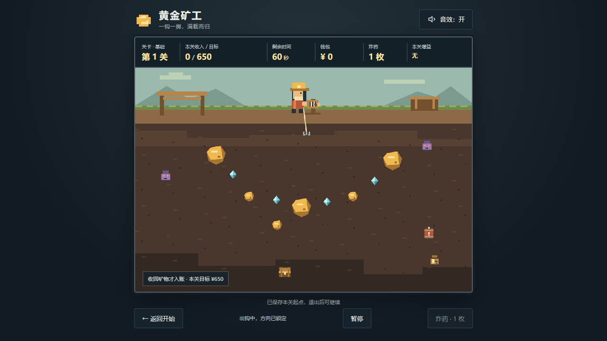

# 黄金矿工 · 无限生存

原生 HTML、CSS、JavaScript 和 Canvas 2D 实现的像素风单机游戏，无构建步骤、运行依赖或远程素材。当前正式版本为 **v1.1.0：关间存档与阶梯难度扩展**。第 13～16 步已完成，源码、文档和玩家下载包均已发布；v1.0.0 保留为历史版本。



## 游玩

双击 `index.html`，使用 Chrome、Edge 等现代桌面浏览器打开。点击“新挑战”；已有存档时点击“继续游戏”。玩家包解压整个目录后同样直接打开，无需 Node.js 或联网。

**下载最新版：** [Gold-survival-v1.1.0.zip](https://github.com/OldBeer1/gold-miner/releases/download/v1.1.0/Gold-survival-v1.1.0.zip) · [v1.1.0 版本说明](https://github.com/OldBeer1/gold-miner/releases/tag/v1.1.0) · [源码仓库](https://github.com/OldBeer1/gold-miner)。

玩家包含完整运行文件和中文说明，共 9 个文件、31,512 字节。从正式 Release 下载、核对校验值并解压后的浏览器复验已通过。SHA-256：`1a2c6d184009f251b13d667c6cf09f3654e4ab3dfa5762c9938485ab7c48b055`。

历史版本：[v1.0.0](https://github.com/OldBeer1/gold-miner/releases/tag/v1.0.0)，不包含新版存档和阶梯难度。

可选本地服务，在项目根目录的 **PowerShell** 执行：

```powershell
node .\scripts\serve.cjs
```

访问 [本机游戏](http://127.0.0.1:8080)，Ctrl+C 停止。端口占用时使用 `node .\scripts\serve.cjs 8081`。文件直开不需要服务。

## 操作与流程

| 操作 | 行为 |
| --- | --- |
| 空格 / 点击矿区 | 钩子待机时沿当前角度出钩 |
| ↓ / S / 炸药按钮 | 销毁携带物，快速空钩收回；不触发收益或风险 |
| Esc / 暂停按钮 | 暂停或继续；切标签自动暂停，回来需主动继续 |
| 返回开始 | 保留挑战存档，回到主页 |
| 音效开关 | 开启或关闭音效并保存 |

从第一关随机开始，没有最终关卡。基础时间 60 秒，提前达标仍可继续赚钱，到时间才结算；物体回到矿工处才入账，在途超时没有收益或特殊效果。

成功 → 商店 → 下一关；失败结束挑战并清档。钱包与炸药跨关保留，增益只影响下一关。本轮总收入只计成功关收入，购物不扣成绩；失败关收入不累计。重新挑战从第一关清空资源并生成新种子。

## 阶梯难度

前三关热身，4～10 关提高目标并增加清障成本。10～19 同档；**20、30、40……关升档**。后期同时提高目标、矿物收益、深度和路线压力，物体数与深度受矿区边界和可解性限制，增长逐渐放缓。

| 关数 | 目标 | 物体数 | 阻挡路线的石头 |
| --- | ---: | ---: | ---: |
| 1 | 650 | 15 | 0 |
| 4 | 1,200 | 18 | 1 |
| 10～19 | 2,100 | 24 | 4 |
| 20～29 | 2,650 | 24 | 4 |
| 30～39 | 2,977 | 25 | 5 |
| 40～49 | 3,210 | 25 | 5 |
| 100 | 3,954 | 26 | 5 |
| 1,000 | 5,795 | 26 | 5 |

每关使用真实摆动、碰撞、拖回和结算规则验证无需道具的 45 秒内达标路线。清障、绕路、炸药和力量药水有不同成本。精确公式、收益倍率和调参证据见 [SAVE_DIFFICULTY_SPEC.md](SAVE_DIFFICULTY_SPEC.md)。

## 抓取物与风险

保留小金块、大金块、石头和钻石；红宝石、钱袋、宝箱、古物和火药桶带来随机机会与风险。下表为基础收入，后期金币乘本关收益倍率并四舍五入；时间、炸药、概率不放大。

| 物体 | 结果 |
| --- | --- |
| 红宝石 | 收回收入 350 |
| 神秘钱袋 | 金币、炸药或时间；小概率扣 5 秒 |
| 宝箱 | 收回随机收入 150 / 450 / 800 |
| 诅咒古物 | 收回收入 500，再扣 5 秒 |
| 火药桶 | 钩尖碰到立即原地爆炸，清除周围物体，空钩返回 |

火药桶不被拖回。80 逻辑画布像素范围内与爆炸相交的未回收物体被销毁，没有收益或特殊效果；不扣时间、不消耗炸药或护身符、无连锁爆炸。护身符只抵消钱袋或古物的第一次时间惩罚。

扣时间到 0 立即结算。时间奖励含延时券每关累计最多 +20 秒，因此最多 80 秒；满五枚炸药时钱袋炸药奖励改为基础金币 +100，同样乘本关收益倍率。完整概率见 [ENDLESS_SPEC.md](ENDLESS_SPEC.md)。

## 商店

固定炸药加随机三种商品，四种无重复，累计最多买四件。一枚炸药计一件；其他商品每店限一份，下一关生效。商品不刷新、不补货，跳过购买始终可用。

价格按**下一关**的难度与收益计算，首次生成商店后报价固定，存档恢复仍保持原价。缺钱、库存满、重复或限购满时不扣钱；卡片显示禁购原因。

| 商品 | 基础价格 | 效果 |
| --- | ---: | --- |
| 炸药 | 100 | +1 枚，库存上限五枚 |
| 力量药水 | 200 | 带物回收速度 ×1.5 |
| 钻石增值剂 | 200 | 钻石价值 ×1.5 |
| 延时券 | 300 | 初始时间 +10 秒 |
| 黄金增值剂 | 250 | 大小金块价值 ×1.5 |
| 护身符 | 180 | 抵消首次扣时间效果并消耗 |
| 幸运符 | 220 | 改善钱袋、宝箱的奖励概率 |

实际售价见卡片；不同增益可同时生效，同种不叠加。红宝石不受钻石增值剂影响。

## 自动保存

- 关卡开始自动保存入口：退出或刷新后从**同一关起点**继续，种子、布局和随机奖励一致；时间、钱包、炸药和增益恢复入关状态，关内新收入、已消耗道具及时间奖励回滚。
- 成功结算和每笔成功购买自动保存商店：报价、商品、钱包、库存、限购次数、增益和成绩保留，恢复不重复入账。
- 返回主页保留挑战；“新挑战”确认后覆盖，取消保留原存档。失败清除本轮存档，最高记录保留。
- 使用 checkpoint.v1 保存挑战、preferences.v2 保存新版记录，只从旧版继承音效；旧成绩键保留不改写。
- 损坏或未知版本不能继续，页面提示后可以开始新挑战。存储不可用或读写删除失败会显示真实结果，游戏仍可玩，关闭后不能保证恢复。

主动退出可以重新尝试本关入口；真正失败后不能继续原挑战。存档属于当前浏览器与地址，移动文件夹、切换文件/服务地址、更换浏览器或清除数据可能使原存档不可用。

## 开发与验收

2026-10-03，Windows、Chrome 154.0.8037.97 的新版验收通过：

- 45 项规则检查，17 个关号各 100 种子，共 1,700 份布局；四种有限策略比较、强制备用布局、升档边界、收益、概率和交易检查。
- 六组存档规则、11 组存档浏览器检查、23 项保留玩法边界检查。
- 原始游戏真实计时连续四关、四次商店进入第五关；第五关失败清档与重新挑战通过。
- 受控高关入口实测 19→20、29→30，报价保存、四件限购及三种商店尺寸通过；实际清障比较普通回收、力量、炸药。
- 原生切标签暂停、手动暂停、三种屏幕尺寸、缩放输入、文件直开/本地服务及七类音效通过；解压的 v1.1.0 玩家包五项浏览器检查通过。

报告和截图使用 `output/playwright/survival-v110-*`；无已知阻断问题。路线比较只检查四种有限策略，不证明全局最快，自动输入也不代表普通玩家平均难度。旧 `survival-*`、`final-*` 和 step01～07 证据分别对应历史版本。

无运行依赖的检查，在 **PowerShell** 执行：

```powershell
node .\scripts\check-checkpoints.cjs
node .\scripts\check-rules.cjs
```

浏览器脚本需要开发环境已有 Playwright 和 Chrome，不是游戏运行依赖。必要时将 `GOLD_PLAYWRIGHT_MODULE` 指向已有包目录。脚本位于 `output/playwright/`：

| 脚本 | 检查 |
| --- | --- |
| verify-survival-real-run.cjs | 原始游戏真实连续试玩，约五分钟 |
| verify-survival-v110-save.cjs | 刷新、覆盖、购物恢复和存储异常 |
| verify-survival-v110-stages.cjs | 19→20 / 29→30、动态报价、清障成本 |
| verify-survival-ui.cjs | 受控布局/时钟的特殊物、增益和交易边界 |
| verify-survival-native-pause.cjs | 原生 Chrome 标签隐藏，无可见性覆盖 |
| verify-survival-smoke.cjs | 尺寸、启动、输入和音效 |
| verify-survival-release.cjs | 独立解压包、文件直开、继续、暂停与碰撞爆炸 |

UI、native-pause、smoke 的 HTTP 部分需先启动本机服务。详细证据与限制见 [VALIDATION.md](VALIDATION.md)，进度与交接见 [IMPLEMENTATION_PLAN.md](IMPLEMENTATION_PLAN.md)。

## 制作玩家包

```powershell
.\scripts\package-release.ps1 -Version 1.1.0
Expand-Archive -LiteralPath .\output\release\Gold-survival-v1.1.0.zip -DestinationPath .\output\release\player-check-new
node .\output\playwright\verify-survival-release.cjs .\output\release\player-check-new
```

包和版本化 SHA-256 清单在本地 output/release，不纳入 Git。仅打包八个运行文件和中文说明，排除浏览器配置、缓存、开发依赖和日志。使用新解压目录，保留旧 ZIP 和 v1.0.0 Release。

## 接手与文件

新对话先读 [AGENTS.md](AGENTS.md)，再读新版规格、进度顶部与最新交接。

| 文件 | 职责 |
| --- | --- |
| index.html / styles.css | 中文页面、继续入口、四卡商店、布局 |
| js/config.js | 玩法、概率、难度数值 |
| js/rules.js | 种子、布局、路线、碰撞、奖励、报价、交易、快照 |
| js/game.js | 单更新循环、输入、流程、暂停、像素绘制 |
| js/storage.js | 版本化挑战存档、记录与旧音效迁移 |
| js/effects.js / js/audio.js | 视觉反馈与音效 |
| SAVE_DIFFICULTY_SPEC.md / steps/13～16 | 当前扩展规则与独立分步 |
| ENDLESS_SPEC.md / steps/08～12 | 无限生存玩法及 v1.0.0 交接 |
| GAME_SPEC.md / steps/01～07 | 原三关版历史规格 |
